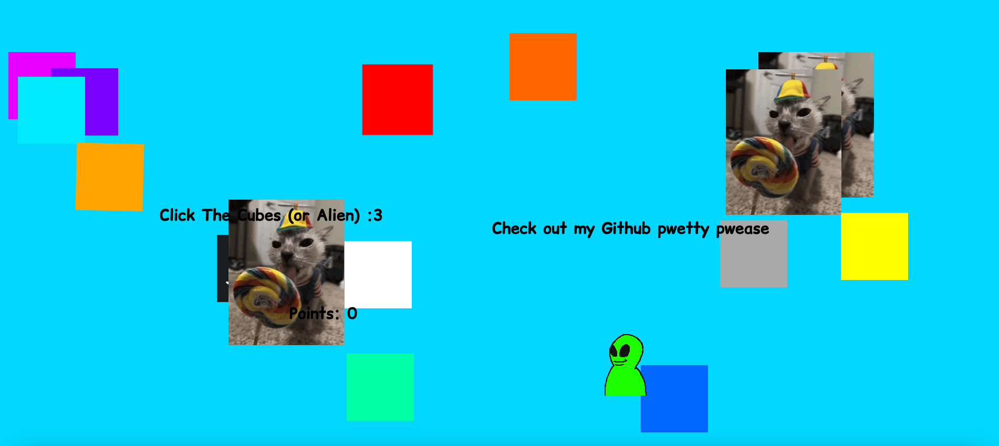
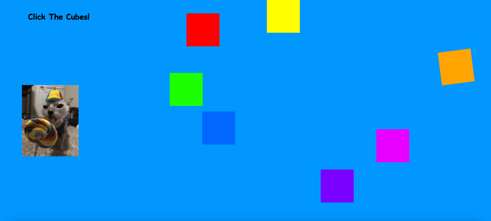

# Squares
## About
This website, Squares, was coded in HTML/CSS/Javascript and was made for the [Hackclub](https://hackclub.com/) YSWS [urspace](https://urspace.hackclub.com/).

The challenge was to make a whimsical website with flying/bouncing elements, so I created Squares! Making this website also helped me learn a ton more about javascript which was fun :3

The website is as simple as clicking squares and watching stuff happen. You can play [here](https://kibbthefox.github.io/Squares/)!

## AI Disclosure

I always tried to actually make the code myself. I tried to only go to AI when I needed something explained. AI code was used twice, first because I spent 20 minutes trying to figure out fading out opacity, and second cuz I couldnt find anything about timers online </3

## Screenshots

